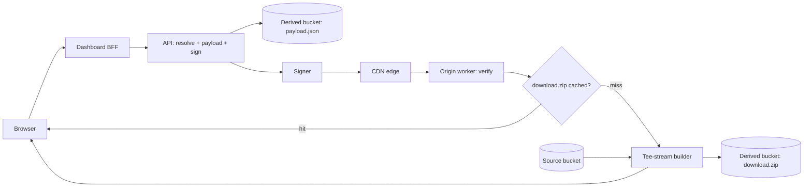

# 02 — Architecture

## Production topology

In the Media Library, "Download All" spans several separately-deployed pieces. The
diagram below matches the flow widget shown in the app (`web/src/lib/flowStages.ts`
drives its node order and labels):

- **Browser** — the dashboard UI. Selects assets, opens an SSE connection to
  watch progress, then follows the resulting signed link to download.
- **Dashboard BFF** — a backend-for-frontend that proxies the browser's
  request to the API, keeping API credentials off the client.
- **API** — resolves the requested asset IDs against the catalog, computes
  the checksum, writes `payload.json`, and mints a signed URL for the
  content path.
- **Derived bucket** — object storage holding two kinds of generated
  objects per checksum: the `payload.json` description and (once built) the
  `download.zip` archive itself.
- **Signer** — the HMAC component that mints and later re-verifies signed
  URLs (see [`03-signed-urls.md`](03-signed-urls.md)).
- **CDN edge** — fronts the origin, caching successful responses and
  forwarding cache misses to the origin worker.
- **Origin worker** — re-verifies the signed token independently of the API
  (the CDN and origin are different trust boundaries), then checks whether
  `download.zip` already exists for the checksum.
- **Tee-stream builder** — on a cache miss, streams the ZIP directly to the
  requester while simultaneously writing it to the derived bucket, so the
  next request for the same checksum is a cache hit. See
  [`04-tee-stream-and-cache.md`](04-tee-stream-and-cache.md).
- **Source bucket** — holds the original, unmodified asset files that the
  builder reads from.

## How the demo maps onto it

This project runs the whole thing as **one Bun/Hono service** (`server/src/`)
plus a static Vite/React frontend (`web/src/`), talking over a dev proxy in
development. The production topology above is really two separate HTTP
requests, and the demo keeps that shape even though one process plays every
role:

- **Mint lane (Step 1)** — browser → dashboard BFF → API, which resolves
  the selection, writes `payload.json`, and signs the download URL.
- **Serve lane (Step 2)** — browser opens the signed URL, which travels
  through the CDN edge to the origin worker, which re-verifies the token,
  checks the cache, and either serves the cached `download.zip` or runs the
  tee-stream builder.

There is no separately-deployed BFF process or CDN in front of this demo —
the `bff` and `cdn` SSE events mark where those hops sit in the mint and
serve lanes so the flow widget can show the full topology, even though the
one Bun/Hono service handles the request directly at that point.

| Diagram node | What it does |
|---|---|
| Browser | `web/src/` — the Vite/React app. |
| Dashboard BFF | Marks the proxy hop that forwards the browser's request to the API. |
| API (resolve + payload + sign) | `server/src/routes.ts` `GET /api/bulk-download/stream` handler. |
| Derived bucket: payload.json | Key `bulk-download/{checksum}/payload.json` in the in-memory derived store, via `server/src/storage.ts`. |
| Signer | `server/src/signer.ts` `UrlSigner`. |
| CDN edge | Marks the edge hop the signed link travels through before reaching the origin. |
| Origin worker: verify | `server/src/routes.ts` `GET /assets/:tenantId/download-all/:checksum/:zipName` route, which calls `signer.verify()` independently of the SSE stream's own `origin-verify` check, then rebuilds the archive from the ids in the signed link and confirms it hashes to the checksum. |
| Cache check | `Storage.existsDerived()` against the `download.zip` key for the checksum. |
| Tee-stream builder | `server/src/zip-archive-builder.ts` `ZipArchiveBuilder`. |
| Derived bucket: download.zip | Key `bulk-download/{checksum}/download.zip` in the in-memory derived store. |
| Source bucket | The four seeded SVGs, bundled in `server/src/sources.ts`. |

The two "buckets" aren't real object storage here: sources are bundled
in-process (`server/src/sources.ts`) and derived objects live in an
in-memory map keyed by checksum (`server/src/storage.ts`). The separation is
the same — originals are read-only inputs, derived objects are
regenerable/cacheable outputs. On serverless this map is per-instance and
best-effort, which is safe because the download is **stateless**: the serve
route rebuilds the archive from the ids carried in the signed link (and
re-checks its checksum), so it never depends on what the earlier request
wrote.

One deliberate simplification worth calling out: because there's no real CDN
or BFF, the SSE stream's `origin-verify` stage and the actual origin route's
own `signer.verify()` call are two separate, independent verifications of
the same token — the SSE stream doesn't shortcut the real check the download
route performs. That's intentional: it demonstrates that the origin
re-verifies rather than trusting an upstream hop, even in single-process form.

## Next

- [`03-signed-urls.md`](03-signed-urls.md) — the signed URL scheme in detail.
- [`04-tee-stream-and-cache.md`](04-tee-stream-and-cache.md) — the builder and cache.
- [`05-sse-flow.md`](05-sse-flow.md) — the SSE event protocol.
- [`06-frontend.md`](06-frontend.md) — the frontend stack.
- Back to [`01-overview.md`](01-overview.md).
