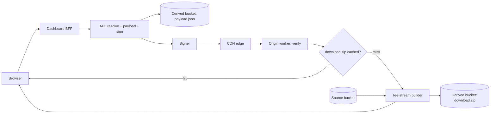

# 02 — Architecture

## Production topology

In Asset Hub, "Download All" spans several separately-deployed pieces. The
diagram below matches the flow widget shown in the app (`web/src/lib/flowStages.ts`
drives its node order and labels):

- **Browser** — the dashboard UI. Selects assets, opens an SSE connection to
  watch progress, then follows the resulting signed link to download.
- **Dashboard BFF** — a backend-for-frontend that proxies the browser's
  request to the API, keeping API credentials off the client.
- **API** — resolves the requested asset IDs against the catalog, computes
  the checksum, writes `payload.json`, and mints a signed URL for the
  content path.
- **Derived bucket** — object storage holding two kinds of generated
  objects per checksum: the `payload.json` description and (once built) the
  `download.zip` archive itself.
- **Signer** — the HMAC component that mints and later re-verifies signed
  URLs (see [`03-signed-urls.md`](03-signed-urls.md)).
- **CDN edge** — fronts the origin, caching successful responses and
  forwarding cache misses to the origin worker.
- **Origin worker** — re-verifies the signed token independently of the API
  (the CDN and origin are different trust boundaries), then checks whether
  `download.zip` already exists for the checksum.
- **Tee-stream builder** — on a cache miss, streams the ZIP directly to the
  requester while simultaneously writing it to the derived bucket, so the
  next request for the same checksum is a cache hit. See
  [`04-tee-stream-and-cache.md`](04-tee-stream-and-cache.md).
- **Source bucket** — holds the original, unmodified asset files that the
  builder reads from.

## How the demo maps onto it

This project runs the whole thing as **one Bun/Hono service** (`server/src/`)
plus a static Vite/React frontend (`web/src/`), talking over a dev proxy in
development. There is no separate BFF process and no CDN — those hops are
**narrated**: the SSE stream emits a `browser` and `bff` event, and a `cdn`
event, purely so the flow widget can show where they'd sit in production,
but no corresponding network hop or process actually exists for them.

| Diagram node | Demo reality | Real / Narrated |
|---|---|---|
| Browser | `web/src/` — the Vite/React app | Real |
| Dashboard BFF | Nothing runs; `bff` SSE event is emitted with a fixed delay | **Narrated** |
| API (resolve + payload + sign) | `server/src/routes.ts` `GET /api/bulk-download/stream` handler | Real |
| Derived bucket: payload.json | `server/storage/derived/bulk-download/{checksum}/payload.json` on local disk, via `server/src/storage.ts` | Real |
| Signer | `server/src/signer.ts` `UrlSigner` | Real |
| CDN edge | Nothing runs; `cdn` SSE event is emitted with a fixed delay | **Narrated** |
| Origin worker: verify | `server/src/routes.ts` `GET /assets/:tenantId/download-all/:checksum/:zipName` route, which calls `signer.verify()` independently of the SSE stream's own `origin-verify` check | Real |
| Cache check | `Storage.existsDerived()` against `download.zip` for the checksum | Real |
| Tee-stream builder | `server/src/zip-archive-builder.ts` `ZipArchiveBuilder` | Real |
| Derived bucket: download.zip | `server/storage/derived/bulk-download/{checksum}/download.zip` | Real |
| Source bucket | `server/storage/source/` (four seeded SVGs) | Real |

Two buckets are two plain directories here (`server/storage/source/` and
`server/storage/derived/`) instead of two S3 buckets, but the separation is
the same: originals are read-only inputs, derived objects are
regenerable/cacheable outputs. `server/storage/derived/` is gitignored —
it's runtime-generated, not source.

One deliberate simplification worth calling out: because there's no real CDN
or BFF, the SSE stream's `origin-verify` stage and the actual origin route's
own `signer.verify()` call are two separate, independent verifications of
the same token — the SSE stream doesn't shortcut the real check the download
route performs. That's intentional: it demonstrates that the origin
re-verifies rather than trusting an upstream hop, even in single-process form.

## Next

- [`03-signed-urls.md`](03-signed-urls.md) — the signed URL scheme in detail.
- [`04-tee-stream-and-cache.md`](04-tee-stream-and-cache.md) — the builder and cache.
- [`05-sse-flow.md`](05-sse-flow.md) — the SSE event protocol.
- [`06-frontend.md`](06-frontend.md) — the frontend stack.
- Back to [`01-overview.md`](01-overview.md).
